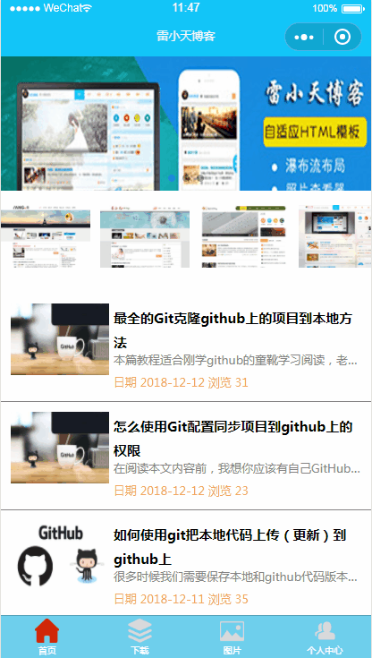

<h1 align="center" style="margin-bottom: 20px;">雷小天博客微信小程序</h1>
<h2 align="center">支持Html及markdown转wxml可视化</h2>
<p align="center"><code>版本号:1.0</code></p>
<p align="center">来源: [雷小天博客](http://www.100txy.com)</p>
<p align="center">作用: 将个人博客网站转换为微信小程序的可视化方案</p>


## 特性


| 支持特性        | 实验功能           | ToDo  |
| ------------- |-------------| -----|
| - [x] HTML的大部分标签解析 | [x] 小表情emjio | [x] table标签 |
| - [x] 内联style          | [x] a标签跳转   |               |
| - [x] 标签Class          | [x] 动态添加    |               |
| - [x] 图片自适应规则       |               |                |
| - [x] 图片多图片预览      |                |               |
| - [x] 模版层级可扩展性    |                |               |
| - [x] 多数据循环方式      |                |  |
| - [x] 内联style         |                |   |
|         |                |   |

## 相关截图




## 基本使用方法

* 1. Copy文件夹`wxParse`
```
- wxParse/
  -wxParse.js(必须存在)
  -html2json.js(必须存在)
  -htmlparser.js(必须存在)
  -showdown.js(必须存在)
  -wxDiscode.js(必须存在)
  -wxParse.wxml(必须存在)
  -wxParse.wxss(必须存在)
  -emojis(可选)
```

* 2. 引入必要文件

```
//在使用的xx.js中引入WxParse模块
var WxParse = require('../../wxParse/wxParse.js');
```

```
//在使用的Wxss中引入WxParse.css,可以在app.wxss
@import "/wxParse/wxParse.wxss";
```

* 3. 数据绑定
```
var article = '<div>我是HTML代码</div>';
/**
* WxParse.wxParse(bindName , type, data, target,imagePadding)
* 1.bindName绑定的数据名(必填)
* 2.type可以为html或者md(必填)
* 3.data为传入的具体数据(必填)
* 4.target为Page对象,一般为this(必填)
* 5.imagePadding为当图片自适应是左右的单一padding(默认为0,可选)
*/
var that = this;
WxParse.wxParse('article', 'html', article, that, 5);
```

* 4. 模版引用
```
// 引入模板
<import src="你的路径/wxParse/wxParse.wxml"/>
//这里data中article为bindName
<template is="wxParse" data="{{wxParseData:article.nodes}}"/>
```


## 相关文章

* [微信小程序如何加载数据库真实数据？](http://www.100txy.com/article/102.html)
* [微信小程序将html转为wxml开发案例](http://www.100txy.com/article/101.html)
* [微信小程序消息推送配置案例](http://www.100txy.com/article/90.html)


## 捐献

* 参见雷小天博客[捐献作者](http://www.100txy.com)

## 来源
[雷小天个人博客](http://100txy.com)
独立开发

*可在网站点击公众号扫描二维码进入我们的微信公众号
[雷小天博客](weixin.jpg)
*其他方式:合作qq：1124378213
